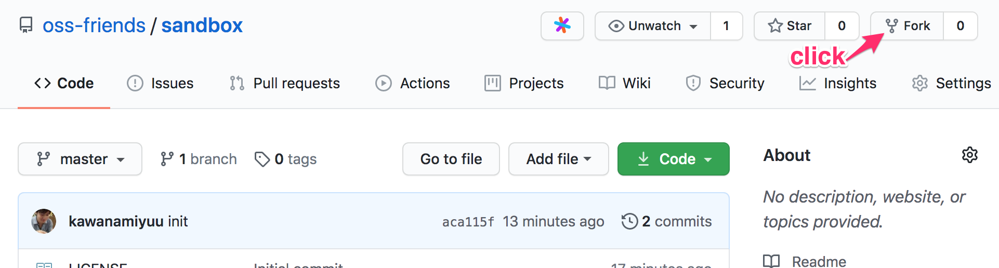
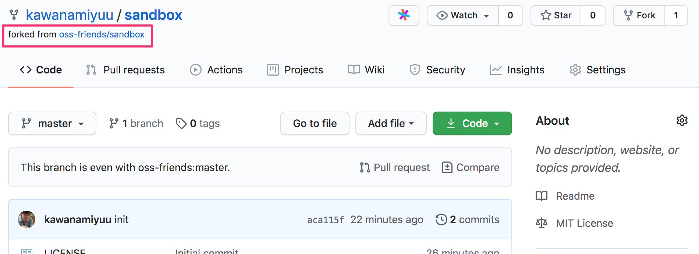
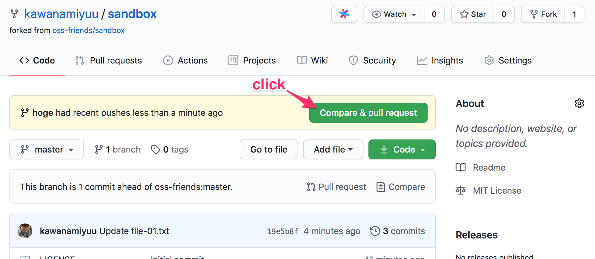
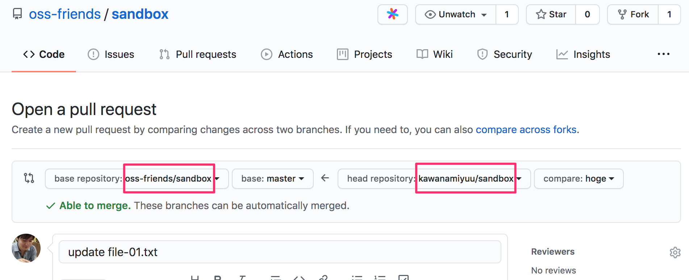
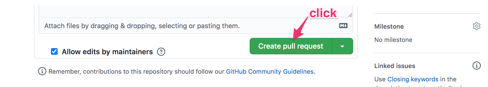
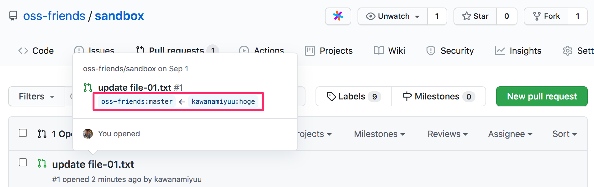

# Contribute to OSS

OSS 勉強会 #2

2020/09/02

@kawanamiyuu

---

## ハンズオン

---

### GitHub で OSS にコントリビュートする具体的な手順

1. GitHub 上で対象のリポジトリを fork する
2. fork したリポジトリをローカルに clone する
3. ローカルでリポジトリに対して作業する
4. リポジトリを GitHub に push し、Pull Request を作成する
5. Pull Request が対象のリポジトリに merge される

---

## 1. GitHub 上で対象のリポジトリを fork する

---



---


---



---

## 2. fork したリポジトリをローカルに clone する

---

```console
$ git clone https://github.com/kawanamiyuu/sandbox.git
```

```console
$ cd sandbox
$ git remote -v
origin	https://github.com/kawanamiyuu/sandbox.git (fetch)
origin	https://github.com/kawanamiyuu/sandbox.git (push)
```

---

## 3. ローカルでリポジトリに対して作業する

---

### Tips: fork 元のリポジトリの変更に追従する方法

```console
$ git remote add upstream https://github.com/oss-friends/sandbox.git
$ git remote -v
origin	https://github.com/kawanamiyuu/sandbox.git (fetch)
origin	https://github.com/kawanamiyuu/sandbox.git (push)
upstream	https://github.com/oss-friends/sandbox.git (fetch)
upstream	https://github.com/oss-friends/sandbox.git (push)
```

```console
$ git pull --rebase upstream master # or `git merge upstream/master`
```

---

## 4. リポジトリを GitHub に push し、Pull Request を作成する

---



---





---



---

## 5. Pull Request が対象のリポジトリに merge される
